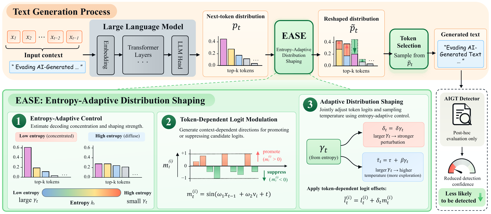

# EASE: Entropy-Adaptive Distribution Shaping for Evading AI-generated Text Detectors

[](https://arxiv.org/abs/2610.09976)
[](LICENSE)

> **EASE** is a training-free decoding method that reshapes next-token
> probabilities according to their entropy.

This repository provides generation-time EASE, EASE rewriting, comparison
methods, and detector evaluation.

## 🧠 Method overview

<p align="center">
  <a href="fig/ease_overview.pdf">
    
  </a>
</p>

EASE uses decoding entropy to scale token-dependent logit offsets and adjust
sampling temperature. The same sampler supports direct generation and rewriting.
[View the vector PDF](fig/ease_overview.pdf).

## 📦 Setup

Use Python 3.10+ and a CUDA-compatible PyTorch build. From the repository root:

```bash
python -m pip install -r requirements.txt
export PYTHONPATH="$PWD/src${PYTHONPATH:+:$PYTHONPATH}"
```

In PowerShell, set `$env:PYTHONPATH = "$PWD\src"` instead.
Model checkpoints are downloaded from Hugging Face; accept any required model
licenses and authenticate beforehand. Qwen3-8B generation in BF16 fits on a
24 GB GPU with the smoke runner's batch size of 1. Larger batches and detectors
that load two models require additional memory.

For the tested smoke environment, install with
`python -m pip install -r requirements.txt -c constraints-smoke.txt` after
installing PyTorch 2.6.0 with CUDA 12.4. This profile covers the quick check below;
Fast-DetectGPT has a separate compatibility limitation in the validation notes.

## 🚀 Quick check

Code checks do not download checkpoints:

```bash
python scripts/check_release.py
python -m unittest discover -s tests -v
```

For a real GPU smoke run:

```bash
python scripts/run_smoke.py --out-dir runs/smoke
```

This generates ten NP, EASE-plugin, and EASE-Rewrite outputs, scores them with
RoBERTa-base against disjoint human calibration/evaluation sets, and independently
verifies the saved metrics. Results are in `summary.csv`, `summary.json`, and
`verification.json`. Interrupted generation and scoring resume from saved chunks.
The ten-example run checks the pipeline; its metrics are not paper results.

## 🧪 Experiments

```bash
bash scripts/run_table1.sh runs/table1
bash scripts/run_cross_detector.sh runs/table1 runs/cross-detector
```

The aligned comparison uses Qwen3-8B and 2,000 evaluation texts:

| Corpus | Setting |
|---|---|
| `np` | vanilla top-k generation, T=1.0 |
| `ease_plugin` | generation-time EASE, T=1.0, delta=2 |
| `ease_rewrite_d2` | one EASE rewrite of NP, T=1.0, delta=2 |
| `simple` / `recursive` | one / two unguided paraphrase passes, T=0.6 |
| `adv_base` / `adv_large` | adversarial paraphrasing with a RoBERTa proxy, T=1.0 |

The cross-detector study evaluates 200 texts per source model (Qwen3-8B,
Llama-3-8B, and Ministral-3-8B). The shell runner covers Qwen/Llama;
[the reproduction guide](docs/REPRODUCTION.md) includes the Ministral commands,
detector roster, staged execution, and PPL evaluation.

Scientific settings and model IDs are defined in [`src/ease/config.py`](src/ease/config.py).
The bundled WikiText split contains ten calibration and ten evaluation records;
full corpora are prepared by the runners and are not included.

AUROC uses held-out human evaluation scores. TPR@1%FPR uses a threshold calibrated
on a separate human-only set, held fixed across methods, with conservative tie
handling. Only final output text is scored. PPL is the mean per-text perplexity
under Qwen3-8B. See [validation status](docs/VALIDATION.md) for tested coverage.

## 🗂️ Code

- [`src/ease/sampling.py`](src/ease/sampling.py): shared EASE distribution.
- `src/ease/`: configuration, metrics, paraphrasing, and detector components.
- `experiments/`: resumable generation, scoring, and independent verification.
- `scripts/`: smoke and full-run entry points.

## 📚 Citation

If you use EASE in your research, please cite our paper:

```bibtex
@misc{zhou2026easeentropyadaptivedistributionshaping,
  title={EASE: Entropy-Adaptive Distribution Shaping for Evading AI-generated Text Detectors},
  author={Jicheng Zhou and Kahim Wong and Jialong Wang and Jiantao Zhou},
  year={2026},
  eprint={2610.09976},
  archivePrefix={arXiv},
  primaryClass={cs.CL},
  url={https://arxiv.org/abs/2610.09976},
}
```

## 📄 License and attribution

Apache 2.0. Adversarial paraphrasing is adapted from
[Adversarial-Paraphrasing](https://github.com/chengez/Adversarial-Paraphrasing).
See [third-party components](docs/THIRD_PARTY.md) and [NOTICE](NOTICE).
